# iappyxOS Launcher

**A programmable Android home screen — describe a widget or wallpaper in plain language and it appears, running on-device.**

Most launchers let you arrange icons. This one does that too — app icons, folders, stock Android widgets, an app drawer, universal search, a swipeable dock — and then lets you *talk to it*. Ask for "hourly weather as colored bars" or "a slow lava-lamp field that reacts to my battery" and the launcher generates a real HTML/JS widget or wallpaper that runs in its own sandbox. No server, no app store, no code.

Sibling project to [iappyxOS](https://github.com/iappyx/iappyxOS) (the on-device APK generator) — both are standalone; you don't need either to run the other. They share the same widget HTML format, so a generated widget runs in both.

## What it does

- **AI-generated widgets** — describe a widget in plain language; the launcher generates a complete HTML5 document and renders it immediately in the cell you tapped. Each placement is a sandboxed instance with its own storage.
- **Programmable wallpapers** — HTML wallpapers that run in their own process, with a constrained bridge subset so they stay ambient. Bundled set + AI-generated.
- **A real launcher** — icons, folders, stock widgets, app drawer, universal search, dock, profiles, gestures, notification badges, icon packs, theming. Everything a daily-driver home screen needs.

Everything except AI generation works offline. The launcher never phones home at render time.

## Screenshots

<table>
<tr>
<td align="center">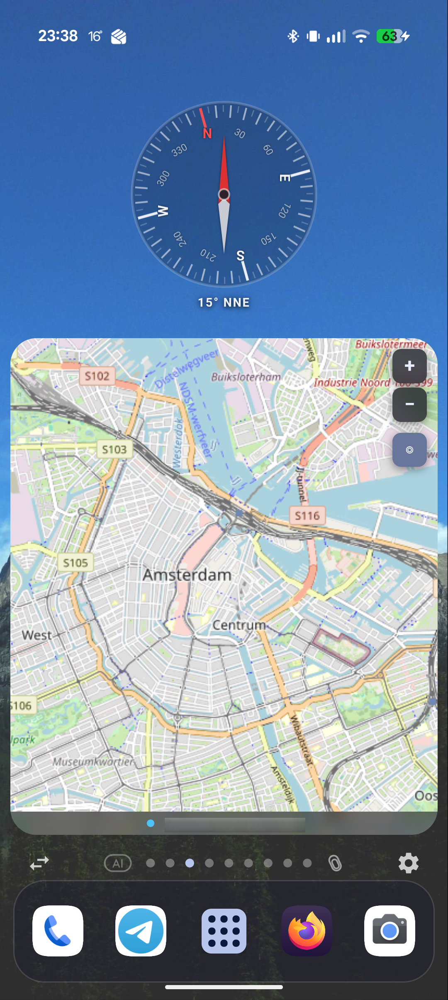<br/><sub>Home with generated widgets</sub></td>
<td align="center">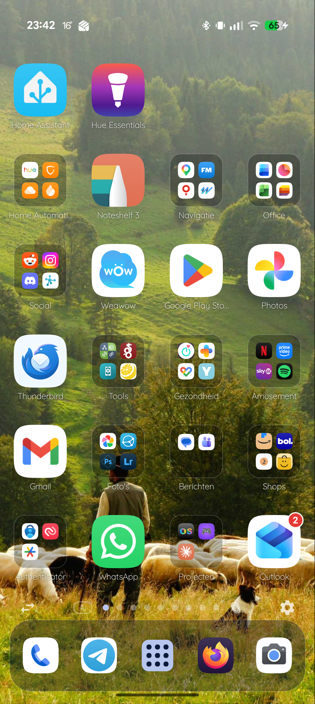<br/><sub>Home with apps + folders</sub></td>
<td align="center">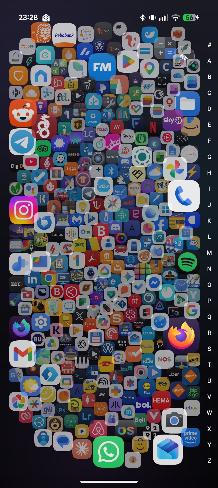<br/><sub>The Field — bubble-organism drawer</sub></td>
</tr>
<tr>
<td align="center">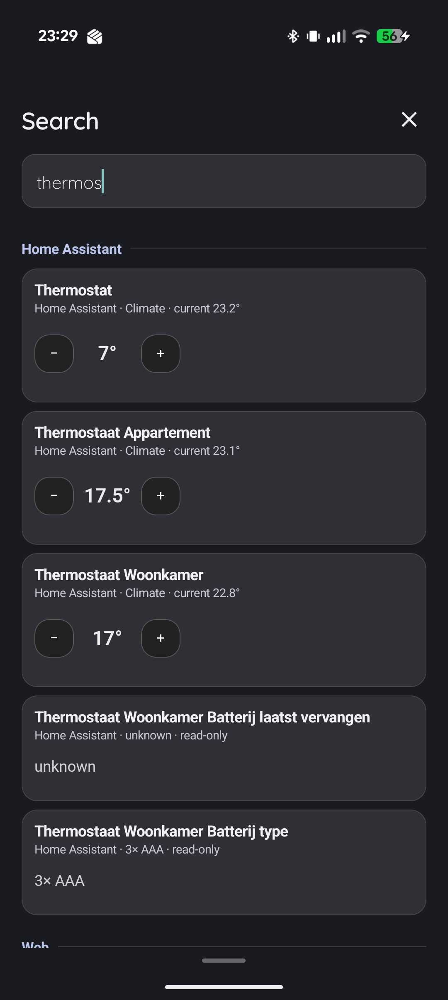<br/><sub>Universal search with inline plugin results</sub></td>
<td align="center">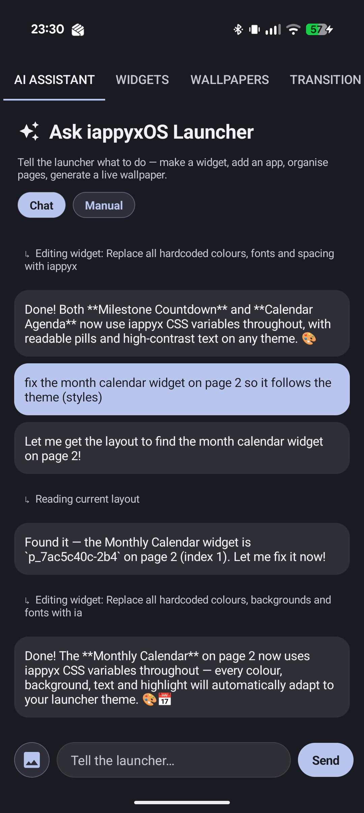<br/><sub>AI command bar mid-conversation</sub></td>
<td align="center">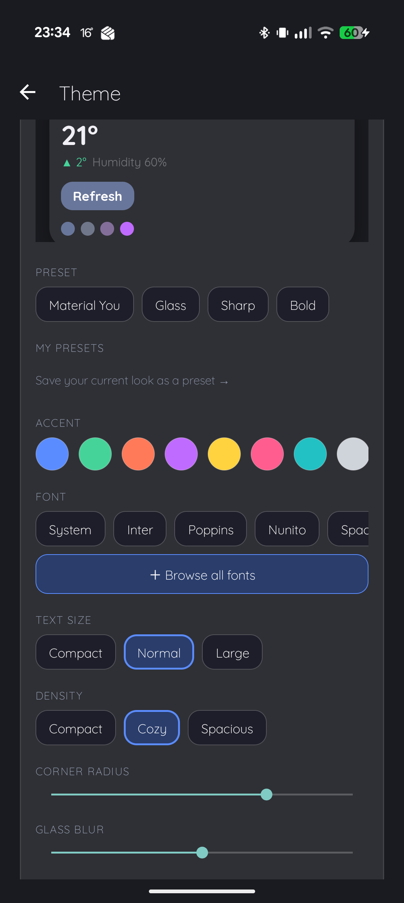<br/><sub>Theme editor</sub></td>
</tr>
<tr>
<td align="center">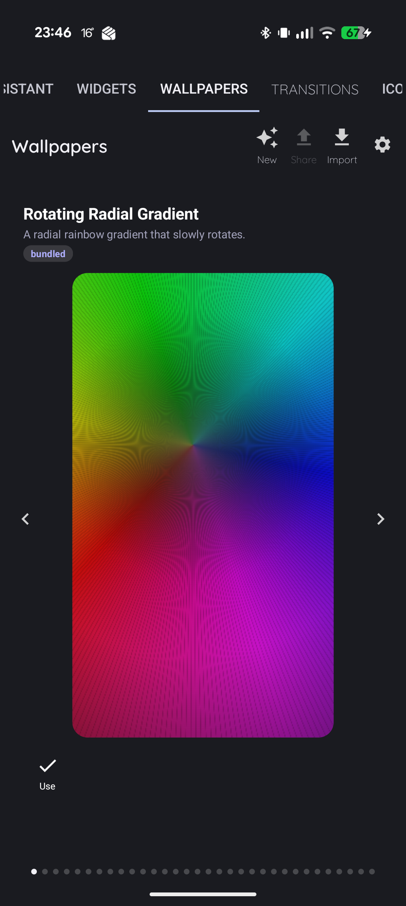<br/><sub>Programmable wallpapers</sub></td>
<td align="center">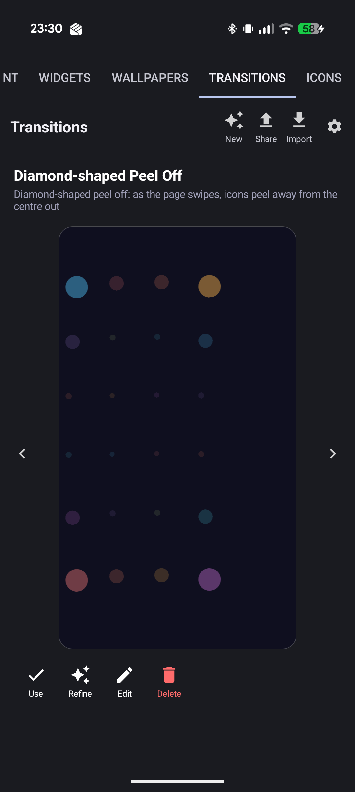<br/><sub>AI-generated page transitions</sub></td>
<td align="center">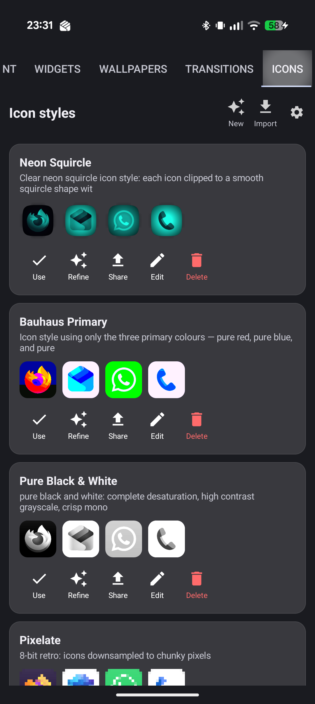<br/><sub>Icon styles</sub></td>
</tr>
<tr>
<td align="center">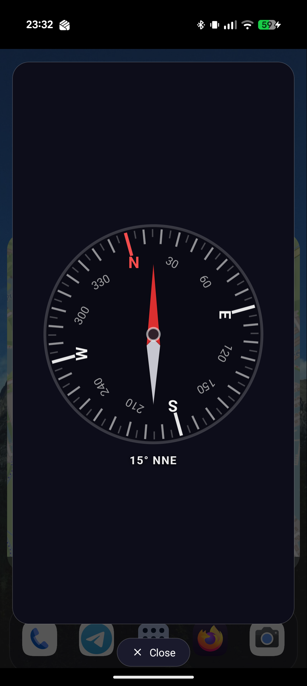<br/><sub>Compass as a Quick&nbsp;Widget overlay</sub></td>
<td align="center">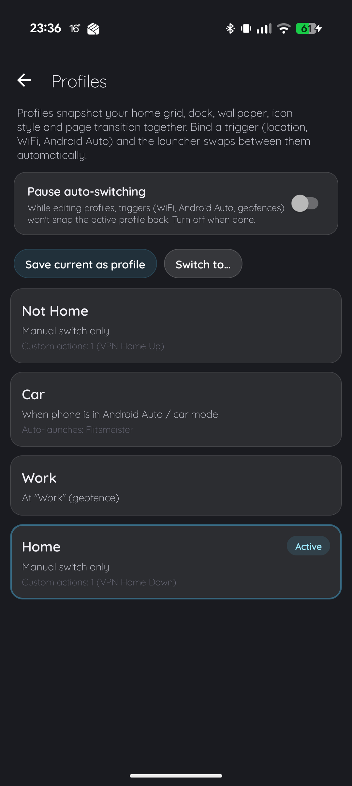<br/><sub>Profiles + triggers</sub></td>
<td align="center">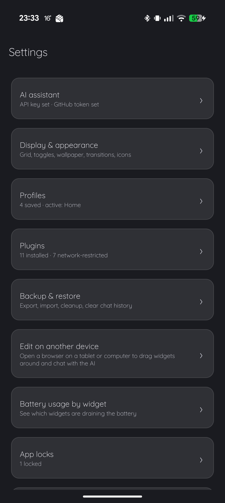<br/><sub>Settings</sub></td>
</tr>
<tr>
<td align="center">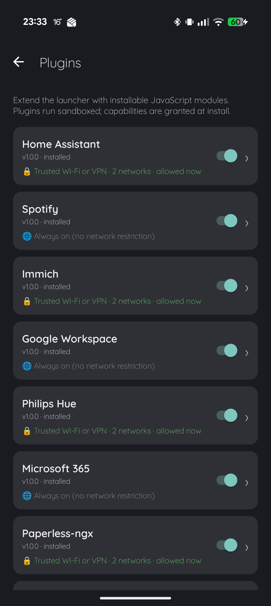<br/><sub>Plugins</sub></td>
<td></td>
<td></td>
</tr>
</table>

## How it works

```
┌──────────────────────────────────────────────┐
│              iappyxOS LAUNCHER                 │
│   icons · folders · dock · drawer · search     │
│   ┌────────────────────────────────────────┐  │
│   │  GENERATED WIDGET (sandboxed WebView)   │  │
│   │  HTML/JS + iappyx.* bridge surface      │  │
│   └────────────────────────────────────────┘  │
└───────────────┬────────────────────────────────┘
                │ describe it in plain language
┌───────────────▼────────────────────────────────┐
│            AI COMMAND BAR (tool-use loop)        │
│  create_generated_widget · place_app_icon ·     │
│  generate_wallpaper · generate_transition ·     │
│  create_folder · move_cell · …                  │
└───────────────┬────────────────────────────────┘
                │ one-shot generation, stored on-device
┌───────────────▼────────────────────────────────┐
│   On-device HTML/JS · per-widget sandbox dirs    │
│   rendered offline every time thereafter         │
└──────────────────────────────────────────────────┘
```

1. You describe a widget (or tap an empty cell first to pin the result there)
2. The AI runs a tool-use loop and writes a complete HTML5 document
3. The document is stored on-device and rendered in a sandboxed WebView
4. The widget gets its own `getFilesDir()` / `getSharedPreferences()` and the full `iappyx.*` bridge surface
5. Every render after that is offline — generation happened once, at create-time

## Features

- **AI command bar** — pager position 0 (left of home page 1). Type a request; the launcher runs a tool-use loop with concrete tools: `create_generated_widget`, `place_app_icon`, `create_folder`, `move_cell`, `add_to_folder`, `swap_cells`, `reorganize_into_folders`, `generate_wallpaper`, `generate_transition`, `generate_icon_filter`, `open_app`, and more. It's **plugin-aware** — "make a widget for my Home Assistant living room" works because the AI knows which plugins you've installed and wires the widget into them.
- **AI-generated page transitions** — describe how pages should animate ("cards that flip," "a parallax slide") and the launcher generates a custom transition, alongside the bundled set.
- **Clippings inbox** — the rightmost home page is a share target: send a video, article, song, image, or note from any app and it lands here as a capture, with per-type auto-expiry so the inbox cleans itself up.
- **Generated widgets** — plain-language → complete HTML5 → rendered in-cell. Sandboxed per placement. Full bridge surface (see table below). AI keys in hardware-backed `EncryptedSharedPreferences`; manual HTML-paste flow for users without a key.
- **Managing & refining widgets** — a Manage screen lists every widget you've made or installed: place it on the grid, **refine it with AI** ("make the numbers bigger," "add a 7-day forecast" — diff-based, so small edits are fast), rename, lock it against further AI edits, browse its files, or delete it. Bundled widgets ship ready to use (clock, compass, weather, QR & barcode scanner, bridge diagnostics) and any of them can be "customized" into your own editable copy.
- **Programmable wallpapers** — HTML wallpapers in a separate `:wallpaper` process via `Presentation` on a `VirtualDisplay`. Constrained 8-bridge subset. Bundled: rotating radial gradient, hue drift, digital rain, falling snow, fireworks, magnetic neon particles, material color drift, bouncing balls, shake-for-a-photo, **battery jelly**. AI-generated too.
- **Home screen** — multi-page swipeable grid, configurable columns / rows / dock slots with a live mini-grid preview. Transparent cells so the wallpaper flows behind everything. Long-press → **edit mode**: drag to move, handles to resize, ghost preview (blue = valid, red = collision), drop on the remove zone to delete, drag a 1×1 onto another → folder.
- **Dock** — swipeable with its own page indicator, always-visible "+" slot, optional labels.
- **App drawer (swipe up)** — full-screen overlay with an auto-categorized chip strip (Games / Social / Productivity / …) and per-app context menu (drag to home, app info, uninstall). Prefer something more playful? Switch to **The Field** in Display & Appearance — a native bubble-organism drawer where apps float as draggable orbs, with the same A–Z fast-scroll.
- **Universal search (swipe down)** — Spotlight-style sheet across installed apps, contacts, device Settings activities, and participating plugins. Plugin matches come back as **interactive inline mini-widgets** — dim a Hue light, toggle a Home Assistant entity, or open a Paperless document straight from the results, without launching anything. Recent searches + frequent apps; Enter launches the top result.
- **Plugins** — capability-gated service integrations (Home Assistant, Spotify, Immich, Paperless, GitHub, and more — see below), installed from the Showcase. Sandboxed settings UI; widgets reach them through the bridge.
- **Quick Widgets** — five Quick Settings tiles that pop a widget as a translucent panel over whatever app you're in, using the same widget runtime as the home grid.
- **Icon packs** — third-party Nova/ADW-compatible icon packs: themed apps swap to the pack's art, unthemed apps optionally get the pack's iconback/mask treatment, and any single app's icon can be overridden by hand.
- **Icon filters + shapes** — a global filter applied across the grid (none, mono accent, wallpaper-themed, rainbow matrix, or AI-generated), with custom shapes including arbitrary SVG `<path>` data.
- **Theming** — set a launcher-wide look in **Settings → Display & Appearance → Theme**: accent color, typeface, text size, spacing density, corner radius, and glassiness. Fonts include 6 bundled families plus 70+ open-source Google Fonts you can download on demand — each previewed live, and downloaded ones are removable to reclaim space. Pick a built-in preset (Material You / Glass / Sharp / Bold), save your own presets, or export/import a theme as a shareable code. Your accent and font flow through everything — generated widgets, home/dock/folder labels, settings, dialogs, bottom sheets, and menus — while backgrounds stay dark by design. Editable on-device **or from the web editor**, kept in sync.
- **Profiles + triggers** — save layout + wallpaper + icon filter + transition as a named profile; auto-switch on WiFi SSID, geofence, Android Auto, or system dark/light. The trigger watcher runs out-of-process (`:trigger`) so the launcher needn't be foreground.
- **Edit on another device** — a local web editor (served from the phone over your network) that mirrors most of the launcher from a laptop browser: rearrange the home grid, manage and AI-refine widgets, edit the theme, chat with the AI command bar, switch profiles, and change settings — with live two-way sync, so changes on either side show up on the other.
- **App locks** — hide chosen apps behind biometric authentication.
- **Battery usage by widget** — Settings surfaces which generated widget held GPS / sensors / audio and roughly how much it's costing you, so a misbehaving widget is easy to spot and remove.
- **Notification badges** — count bubbles on icons + folders, backed by a `NotificationListenerService`.
- **Showcase browser** — browse + one-tap install community widgets, wallpapers, transitions, icon filters, and plugins from a GitHub-backed index. Submit your own via a pre-filled GitHub issue.
- **Backup, restore & transfer** — a single `.iappyxbackup` zip via the SAF picker (REPLACE or MERGE on import), WiFi-Direct **Nearby send**, and chunked **QR transfer**.
- **Multi-process, edge-to-edge, dark-only** — `main` / `:wallpaper` / `:trigger`; cross-process state synced via broadcasts; edge-to-edge on SDK 35+; dark theme by design.
- **More to tune** — Display & Appearance also covers grid columns / rows / dock slots (with a live preview), dock labels, rotation behavior (allow rotation + a preferred orientation), how unthemed icons are masked, the home long-press interaction, and language (English / Dutch).

## Quick start

1. [Download the latest build](https://github.com/iappyx/iappyxOS-Launcher/raw/main/bin/iappyxOS-Launcher.apk)
2. Sideload on Android 10+ (enable "Install unknown apps" for your browser)
3. Set it as your home app: **Settings → System → Default home app → iappyxOS Launcher**

Requires an **ARM64** device on **API 29+ (Android 10+)**. The ML Kit native libs are 64-bit-only, so emulators and 32-bit phones won't work. Prefer to build it yourself? See [Building from source](#building-from-source) below.

### AI features (optional)
Drop your Anthropic API key into **Settings → AI** in-app. It's stored in hardware-backed encrypted preferences. No key ⇒ AI features show a "no key" message; manual HTML paste still works for widgets.

### Push notifications (optional)
To enable the FCM push bridge for widgets, drop a `firebase_config.json` (your project's google-services config, renamed) into `app/src/main/assets/app/`. Gitignored, never committed. Without it the push bridge reports "Firebase not configured" and everything else works unchanged.

## Widget bridges

Generated widgets access device hardware through a JavaScript bridge (`window.iappyx`) — the same surface an iappyxOS-generated standalone APK gets:

| Bridge | What it does |
|--------|-------------|
| Storage | Per-widget key-value, file storage, bundled-asset reads, sandboxed to each placement |
| Camera | Photo, video, QR/barcode scan, OCR, ML image labeling, selfie segmentation, flashlight |
| Location | GPS single shot, continuous tracking, geofencing |
| Sensors | Accelerometer, gyroscope, magnetometer, compass heading, proximity, light, pressure, step counter |
| Audio | Play/pause/seek/loop, record, speech-to-text, sound effects, audio focus, audio visualizer (waveform + FFT) |
| Notifications | Send with actions, schedule, repeating, badge count, cancel |
| NFC | Read tags, write NDEF text/URI |
| Bluetooth LE | Scan, connect, read/write characteristics, subscribe to notifications |
| Bluetooth Classic | Serial (SPP) for Arduino, ESP32, OBD-II, HC-05/06 |
| SQLite | Full SQL database with transactions, per-widget |
| Biometric | Fingerprint/face authentication |
| TTS | Text-to-speech with language, pitch, rate, completion callback |
| Contacts | Read device contacts |
| SMS | Send SMS messages |
| Calendar | Read/add calendar events |
| Clipboard | Read/write, monitor changes |
| Vibration | Patterns, haptic feedback |
| Alarms | Exact and repeating alarms |
| HTTP Server | Local HTTP/HTTPS server with TLS, CORS, file streaming |
| HTTP Client | Native requests with self-signed cert support, multipart, cookies (OkHttp) |
| SSH / SFTP | Remote terminal, command execution, file transfer (JSch) |
| SMB | Browse Windows/NAS shares, upload/download/copy/rename/delete (jCIFS-NG) |
| TCP / UDP | Persistent sockets with TLS; datagram unicast + multicast |
| NSD (mDNS) | Service registration, discovery, resolve |
| Push | FCM push notifications (requires Firebase config) |
| Tasks | Scheduled background JS (fetch APIs, update widgets while idle) |
| Triggers | Fire JS on screen on/off, charger, headphones, ringer, airplane, battery, BT connect, WiFi, Android Auto |
| Plugin | Call into installed plugins (Home Assistant, Spotify, …) through a gated proxy |
| Capabilities | Query available bridges + permissions at runtime |

Wallpapers get a deliberately small subset (storage, device info, sensors, location, calendar read, SQLite, HTTP client, capabilities + the layout snapshot) — ambient, not application-grade.

## Plugins

Plugins are capability-gated service integrations, distributed via the [Showcase](https://github.com/iappyx/iappyxOS-showcase) and installed in-app. They expose a typed method surface to widgets (and optionally to universal search), with credentials kept in the plugin's own sandboxed settings page. Current set:

Home Assistant · Spotify · Immich · Paperless-ngx · GitHub · Microsoft 365 · Google Workspace · Philips Hue · Unraid · MQTT · AdGuard Home

## Building from source

### Prerequisites
- JDK 17
- Android SDK (compileSdk 35)
- An ARM64 Android device on API 29+ (emulators won't work)

### Quick build
```bash
./build.sh
# Output: bin/iappyxOS-Launcher.apk (auto-installs if one device is connected)
```

### Explicit Gradle
```bash
cd src/launcher
./gradlew :app:assembleDebug
adb install -r app/build/outputs/apk/debug/app-debug.apk
```

`assembleRelease` copies the APK into `bin/iappyxOS-Launcher.apk` regardless of where in the tree the build ran. That file is **tracked** in this repo and is the primary download link, so anyone landing on the README can grab the latest build directly without having to build from source.

### Signing
Release builds are signed with the debug keystore unless you provide your own. To set up a release key:

```bash
keytool -genkey -v -keystore iappyxos-launcher.jks -keyalg RSA -keysize 2048 -validity 10000 -alias iappyx
```

Point the Gradle signing config at it via `keystore.properties` (gitignored). Never commit your keystore or passwords.

### Repo layout
```
iappyxOS-Launcher/
├── bin/                       # auto-populated on assembleRelease, gitignored
├── build.sh                   # wrapper: cd src/launcher && assembleRelease (+ install)
├── src/launcher/              # self-contained Gradle project (own wrapper)
│   └── app/src/main/
│       ├── AndroidManifest.xml
│       ├── java/com/iappyx/launcher/
│       │   ├── LauncherActivity.kt      # home pager, dock, edit mode, drag router
│       │   ├── WidgetHost.java          # per-widget bridge surface (sandboxed)
│       │   ├── PlacementStore.kt        # atomic JSON layout persistence
│       │   ├── ai/ command/             # Anthropic client + AI command bar loop
│       │   ├── cells/                   # IconCell, IconMask, IconShape, IconPack, filters
│       │   ├── plugins/ quickwidget/    # plugin host + Quick Settings widget tiles
│       │   ├── remoteedit/              # "Edit on another device" service + web editor
│       │   ├── profile/ search/ wallpaper/ widget/ backup/ sharing/ notify/
│       │   └── …
│       ├── assets/            # bundled wallpapers + leaflet for the geofence picker
│       └── res/               # layouts, strings (en + nl), themes, drawables
├── README.md  ·  FAQ.md  ·  LICENSE
└── .gitignore
```

### Architecture notes
- **`WidgetHost extends ContextWrapper`** — overrides `getFilesDir()` / `getSharedPreferences()` so every storage call is scoped to the per-widget sandbox. The same widget HTML runs identically here or as an iappyxOS-generated standalone APK.
- **Cross-process state** uses broadcasts carrying the canonical value inline as an extra — receivers in `:wallpaper` / `:trigger` read the extra rather than re-reading prefs (whose cache is stale for cross-process writers).
- **`PlacementStore.save()`** writes via tmp-file + `Files.move(ATOMIC_MOVE)` so a process death mid-write can't corrupt the layout.
- **`AppRegistry`** prewarms the installed-apps list + per-app icons on a background thread at startup, so the first home swipe / drawer open / search isn't blocked.
- **`IconMask`** caches rendered icons by `(packageName, sizePx, filterSlug, pack)`, prewarmed for every referenced package, so first paint hits a warm cache.

## FAQ

See [FAQ.md](FAQ.md) for common questions and gotchas — including "do I need iappyxOS to run this?", "why ARM64 only?", "can a widget I install do bad things?", and "will my widgets keep working if I uninstall the launcher?"

## Privacy

All data lives on your device. AI keys are stored in Android's hardware-backed encrypted preferences. No analytics, no tracking, no telemetry. Network requests go only to the AI provider you configured (when you ask the AI to do something), to GitHub (when you open the Showcase or download a theme font), to Google Fonts (only to preview a font you haven't downloaded yet, from the theme picker), and to Firebase Cloud Messaging (only when a widget uses the push bridge).

## License

MIT — see [LICENSE](LICENSE).

Bundled third-party libraries and fonts are listed in **Settings → About → Open-source libraries** in-app, with full canonical license texts. Includes a notable LGPL-2.1+ dependency (jCIFS-NG, used for the SMB bridge) — see the in-app license dialog for relink rights. The bundled theme fonts are licensed under the SIL Open Font License 1.1.

THE SOFTWARE IS PROVIDED "AS IS", WITHOUT WARRANTY OF ANY KIND, EXPRESS OR IMPLIED, INCLUDING BUT NOT LIMITED TO THE WARRANTIES OF MERCHANTABILITY, FITNESS FOR A PARTICULAR PURPOSE AND NONINFRINGEMENT. IN NO EVENT SHALL THE AUTHORS OR COPYRIGHT HOLDERS BE LIABLE FOR ANY CLAIM, DAMAGES OR OTHER LIABILITY, WHETHER IN AN ACTION OF CONTRACT, TORT OR OTHERWISE, ARISING FROM, OUT OF OR IN CONNECTION WITH THE SOFTWARE OR THE USE OR OTHER DEALINGS IN THE SOFTWARE.

## Support

If you find iappyxOS Launcher useful, consider [buying me a coffee](https://ko-fi.com/iappyx).
